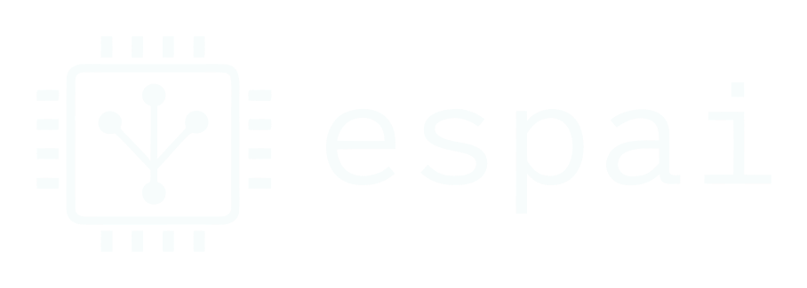

<p align="center">
  
</p>

<p align="center">
  <strong>Unified AI API Client for ESP32</strong>
</p>

<p align="center">
  <a href="https://registry.platformio.org/libraries/enkei0x/ESPAI"></a>
  <a href="https://www.arduino.cc/"></a>
  
  <a href="https://opensource.org/licenses/MIT"></a>
  <a href="https://www.espressif.com/"></a>
  
</p>

> 🚀 Bring the power of GPT, Claude, Gemini and local LLMs to your ESP32 projects!

ESPAI is a lightweight, easy-to-use Arduino library that lets you integrate OpenAI, Anthropic, Google Gemini and Ollama APIs into your ESP32 projects. Supports ESP32, ESP32-S2, ESP32-S3, and ESP32-C3. Build smart IoT devices, voice assistants, and AI-powered gadgets with just a few lines of code.

```cpp
#include <ESPAI.h>
using namespace ESPAI;

OpenAIProvider ai("sk-your-key");  // or AnthropicProvider / GeminiProvider / OllamaProvider

std::vector<Message> messages = { Message(Role::User, "Hello from ESP32!") };

Response res = ai.chat(messages, ChatOptions());

Serial.println(res.content);
```

---

## ✨ Features

- 🎯 **Simple API** — Clean, intuitive interface for chat completions
- 🔒 **Secure by Default** — Embedded root CA certificates for proper TLS verification
- 🌊 **Streaming Support** — Real-time token-by-token responses via SSE
- 🛠️ **Tool Calling** — Function calling for agentic workflows with unified schema across all providers
- 💬 **Conversation History** — Built-in multi-turn context management with auto-pruning and serialization
- 🔄 **Multiple Providers** — OpenAI, Anthropic (Claude), Google Gemini, Ollama and any OpenAI-compatible API through a single unified interface
- 🏠 **Local LLMs** — Run models locally with Ollama, no API key or internet required
- 📦 **Lightweight** — Minimal memory footprint, optimized for ESP32
- ⚡ **Async Support** — Non-blocking FreeRTOS-based async chat and streaming
- 🔁 **Auto Retry** — Built-in retry with exponential backoff for rate limits and server errors
- 🧪 **Well Tested** — 451+ native unit tests, CI-ready
- 🏗️ **Clean Architecture** — Layered design with separated HTTP transport, providers, and conversation management

---

## 🏆 Why ESPAI?

- **Secure by design** — Embedded root CA certificates for proper TLS verification out of the box
- **Production-ready** — 451+ unit tests running natively, so you can refactor and ship with confidence
- **Conversation memory** — Built-in multi-turn history with automatic pruning and JSON serialization
- **Write once, run on any provider** — Define tools once, unified schema works across OpenAI, Claude, Gemini, and Ollama
- **Your choice of tooling** — First-class support for both PlatformIO and Arduino IDE
- **Modern C++17** — Namespaced, clean layered architecture that's easy to extend and debug

---

## 📦 Installation

### PlatformIO (Recommended)

Add to your `platformio.ini`:

```ini
lib_deps =
    enkei0x/ESPAI@^0.8.0
```

### Arduino IDE

1. Download the latest release from [GitHub Releases](https://github.com/enkei0x/espai/releases)
2. In Arduino IDE: **Sketch → Include Library → Add .ZIP Library**
3. Select the downloaded ZIP file

### Manual Installation

```bash
cd ~/Arduino/libraries  # or PlatformIO lib folder
git clone https://github.com/enkei0x/espai.git
```

---

## 🚀 Quick Start

```cpp
#include <WiFi.h>
#include <ESPAI.h>

using namespace ESPAI;

OpenAIProvider openai("sk-your-api-key");

void setup() {
    Serial.begin(115200);

    // Connect to WiFi
    WiFi.begin("your-ssid", "your-password");
    while (WiFi.status() != WL_CONNECTED) delay(500);

    // Send a message
    std::vector<Message> messages;
    messages.push_back(Message(Role::User, "Hello! What's 2+2?"));

    Response response = openai.chat(messages, ChatOptions());

    if (response.success) {
        Serial.println(response.content);
    }
}

void loop() {}
```

---

## 📖 Examples

| Example | Description |
|---------|-------------|
| [BasicChat](examples/BasicChat) | Simple request/response |
| [StreamingChat](examples/StreamingChat) | Real-time streaming output |
| [ConversationHistory](examples/ConversationHistory) | Multi-turn conversations |
| [ToolCalling](examples/ToolCalling) | Function calling workflow |
| [CustomOptions](examples/CustomOptions) | All configuration options |
| [ErrorHandling](examples/ErrorHandling) | Retry logic and error handling |
| [StreamingToolCalling](examples/StreamingToolCalling) | Tool calling with streaming responses |
| [AnthropicChat](examples/AnthropicChat) | Using Anthropic Claude models |
| [GeminiChat](examples/GeminiChat) | Using Google Gemini models |
| [AsyncChat](examples/AsyncChat) | Non-blocking async requests (FreeRTOS) |

---

## 🌊 Streaming Responses

Get responses token-by-token for a better user experience:

```cpp
openai.chatStream(messages, options, [](const String& chunk, bool done) {
    Serial.print(chunk);  // Print each token as it arrives
    if (done) Serial.println("\n--- Done! ---");
});
```

---

## 🛠️ Tool Calling

Let the AI call functions in your code:

```cpp
// Define a tool
Tool tempTool;
tempTool.name = "get_temperature";
tempTool.description = "Get current temperature from sensor";
tempTool.parametersJson = R"({"type":"object","properties":{}})";

ai.addTool(tempTool);

// Send message - AI may request to call the tool
Response response = ai.chat(messages, options);

if (ai.hasToolCalls()) {
    // Add assistant message with tool calls to history
    messages.push_back(ai.getAssistantMessageWithToolCalls(response.content));

    for (const auto& call : ai.getLastToolCalls()) {
        // Execute your function
        String result = "{\"temperature\": 23.5}";
        messages.push_back(Message(Role::Tool, result, call.id));
    }
    // Get final response
    response = ai.chat(messages, options);
}
```

---

## 💬 Conversation History

Maintain context across multiple turns:

```cpp
Conversation conv;
conv.setSystemPrompt("You are a helpful IoT assistant.");
conv.setMaxMessages(20);  // Auto-prune old messages

// User asks something
conv.addUserMessage("Turn on the lights");
Response resp = openai.chat(conv.getMessages(), options);
conv.addAssistantMessage(resp.content);

// Follow-up question (context preserved)
conv.addUserMessage("Make them brighter");
resp = openai.chat(conv.getMessages(), options);
```

---

## ⚡ Async Requests

Run AI requests in the background without blocking your main loop:

```cpp
AIClient client(Provider::OpenAI, "sk-your-api-key");

// Fire-and-forget with callback
client.chatAsync("Hello!", [](const Response& resp) {
    Serial.println(resp.content);
});

// Or poll manually
ChatRequest* req = client.chatAsync("Hello!");
while (!req->isComplete()) {
    req->poll();
    // ... do other work
}
Serial.println(req->getResult().content);
```

---

## ⚙️ Configuration

### ChatOptions

Parameters are only sent to the API when explicitly set. If you leave a parameter at its default, the provider's own default is used.

```cpp
ChatOptions options;
options.temperature = 0.7;            // Creativity (0.0 - 2.0)
options.maxTokens = 1024;             // Max response length
options.maxCompletionTokens = 4096;   // OpenAI reasoning models (o1, o3); priority over maxTokens
options.topP = 0.9;                   // Nucleus sampling
options.frequencyPenalty = 0.5;       // Reduce repetition (-2.0 - 2.0)
options.presencePenalty = 0.3;        // Encourage new topics (-2.0 - 2.0)
options.model = "gpt-4.1-mini";      // Model override
options.systemPrompt = "...";        // System instructions
```

### Provider Setup

```cpp
// OpenAI
OpenAIProvider openai("sk-...");
openai.setModel("gpt-4o");
openai.setTimeout(30000);

// Anthropic (Claude)
AnthropicProvider claude("sk-ant-...");
claude.setModel("claude-sonnet-4-20250514");

// Google Gemini
GeminiProvider gemini("AIza...");
gemini.setModel("gemini-2.5-flash");

// Ollama (local, no API key needed)
OllamaProvider ollama;
ollama.setModel("llama3.2");

// Any OpenAI-compatible API (Groq, DeepSeek, Together AI, etc.)
OpenAICompatibleConfig config;
config.name = "Groq";
config.baseUrl = "https://api.groq.com/openai/v1/chat/completions";
config.apiKey = "gsk-...";
config.model = "llama-3.3-70b-versatile";
OpenAICompatibleProvider groq(config);
```

---

## 📊 Memory Usage

ESPAI is optimized for constrained environments:

| Component | RAM Usage |
|-----------|-----------|
| Provider instance | ~200 bytes |
| Per message | ~50 bytes + content |
| SSL connection | ~40 KB (one-time) |

💡 **Tip:** Use streaming for long responses to reduce peak memory usage.

To save flash, disable unused providers:

```cpp
#define ESPAI_PROVIDER_ANTHROPIC 0
#define ESPAI_PROVIDER_GEMINI 0
#define ESPAI_PROVIDER_OLLAMA 0
#include <ESPAI.h>
```

---

## 🔧 Troubleshooting

### Common Issues

**"Connection failed"**
- Check WiFi connection
- Verify API endpoint is reachable
- Ensure HTTPS/SSL is working

**"Authentication error"**
- Verify your API key is correct
- Check API key has proper permissions

**"Out of memory"**
- Reduce `maxTokens`
- Use streaming instead of buffered responses
- Clear conversation history periodically

**"Timeout"**
- Increase timeout: `provider.setTimeout(60000)`
- Check network stability

---

## 🗺️ Roadmap

- [x] OpenAI provider
- [x] Anthropic (Claude) provider
- [x] Google Gemini provider
- [x] Ollama provider (local LLMs)
- [x] OpenAI-compatible base (Groq, DeepSeek, Together AI, LM Studio, OpenRouter, etc.)
- [x] Streaming support
- [x] Tool/function calling
- [x] Conversation history management
- [x] Plain HTTP transport (for local providers)
- [ ] Vision support (image inputs)
- [ ] Embeddings API

Have a feature request? [Open an issue](https://github.com/enkei0x/espai/issues)!

---

## 🤝 Contributing

Contributions are welcome! Please feel free to submit a Pull Request.

1. Fork the repository
2. Create your feature branch (`git checkout -b feature/amazing`)
3. Commit your changes (`git commit -m 'Add amazing feature'`)
4. Push to the branch (`git push origin feature/amazing`)
5. Open a Pull Request

---

## 📄 License

This project is licensed under the MIT License - see the [LICENSE](LICENSE) file for details.

---

## 🙏 Acknowledgments

- [ArduinoJson](https://arduinojson.org/) — JSON parsing
- [OpenAI](https://openai.com/) — GPT models
- [Anthropic](https://anthropic.com/) — Claude models
- [Google Gemini](https://ai.google.dev/) — Gemini models
- [Ollama](https://ollama.com/) — Local LLM runtime

---

<p align="center">
  Made with ❤️ for the ESP32 community
</p>
